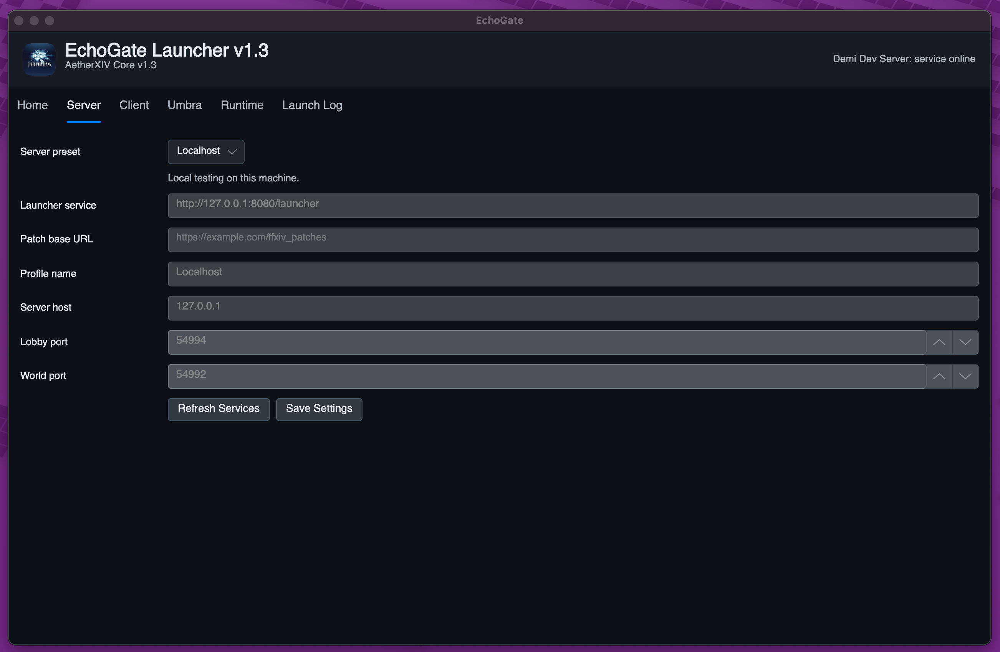

# AetherXIV Core + Echo Gate

AetherXIV Core is the FFXIV 1.x private research and local playtest stack. It includes the Lobby, World, and Map servers plus Echo Gate, a cross-platform launcher for configuring a local server, preparing local client-derived runtime data, and launching a user-owned FFXIV 1.23b client.

This project is independent and is moving toward a new .NET 10-era AetherXIV architecture.

[Join the Discord](https://discord.gg/P9CwrCPWsA)


## Start Here

Use the platform guide that matches the machine you are setting up:

- [macOS Apple Silicon](docs/guides/MACOS_APPLE_SILICON.md)
- [Linux ARM/x86](docs/guides/LINUX_ARM_X86.md)
- [Windows ARM/x86](docs/guides/WINDOWS_ARM_X86.md)
- [Steam Deck experimental](docs/guides/STEAM_DECK_EXPERIMENTAL.md)

For a quick project overview:

- [Echo Gate features](docs/ECHO_GATE_FEATURES.md)
- [Launcher news guide](docs/guides/LAUNCHER_NEWS.md)
- [AetherXIV server features](docs/AETHERXIV_FEATURES.md)
- [Current status matrix](docs/STATUS.md)
- [Supported platforms](docs/SUPPORTED_PLATFORMS.md)
- [Release builds](docs/RELEASES.md)
- [Future development](docs/FUTURE_DEVELOPMENT.md)
- [Reverse-engineering tools](docs/REVERSE_ENGINEERING_TOOLS.md)

## What Works Now

- Local MariaDB setup uses checked-in defaults from `.env.defaults`.
- `tools/setup-local-db.sh` creates the default database `ffxiv_server` and app user `aetherxiv` with password `aether_dev`.
- `.env.local` is optional and only needed for local overrides or stronger private credentials.
- The PHP launcher services support status, news, login, account creation, patch manifests, and runtime catalog metadata.
- Echo Gate can configure a local server profile, validate a local 1.23b client, validate/apply user-provided patch files, prepare `staticactors.bin`, select a runtime, and collect launch logs.
- macOS and Linux launcher builds can run the Windows client through Wine-compatible runtimes.
- Windows launcher builds can run the Windows client directly.
- Linux setup includes Wine graphics/runtime dependency handling and safer launch diagnostics.

Client installers, client files, patch payloads, and patch torrents are not stored in this repository. Echo Gate works with local files that the user already has and selects.

## Default Local Setup

For local development and self-hosting, the default database values are:

```text
database: ffxiv_server
username: aetherxiv
password: aether_dev
hosts: localhost, 127.0.0.1
```

Existing databases can apply non-destructive launcher/Umbra service migrations with:

```sh
./tools/apply-db-migrations.sh
```

Run migrations after pulling newer 1.3 branch changes. They add service tables
and gameplay seed updates such as the Gridania tutorial companion action lists
without dropping existing accounts or characters.

The setup script asks for MariaDB admin credentials only when it needs them. On Ubuntu-style socket-auth installs, it can fall back to `sudo` root access.

```sh
./tools/setup-local-db.sh
```

The common local server ports are:

```text
launcher HTTP: 8080
lobby server: 54994
world server: 54992
map server: 1989
```



## Solution Layout

- `Lobby Server/`: login and character selection service.
- `World Server/`: world-level routing, chat, and zone session coordination.
- `Map Server/`: zone/map simulation and gameplay state.
- `Common Class Lib/`: shared libraries used by all servers.
- `Data/`: runtime configuration, SQL, PHP services, Lua scripts, and local runtime data.
- `launcher/EchoGate/`: cross-platform FFXIV Classic launcher, patcher, runtime manager, and launch diagnostics.
- `tools/`: setup, build, run, runtime-data, and diagnostic helpers.
- `playtest-bridge/`: one-terminal playtest control and localhost bridge tooling.

## Server Flow

1. The client signs in through the launcher service and connects to the Lobby Server.
2. The Lobby Server authenticates the session and returns the selected world server address and port.
3. The client reconnects to the World Server.
4. The World Server coordinates session state and hands zone work to the Map Server.

Start local services in this order:

```sh
./tools/run-web.sh
./tools/run-lobby.sh
./tools/run-map.sh
./tools/run-world.sh
```

`tools/run-map.sh` and `tools/copy-runtime-data.sh` will try to prepare `Data/staticactors.bin` automatically from the saved Echo Gate client path or `CLIENT_DIR`.

## Build Checks

Legacy server build:

```sh
./tools/build-legacy.sh
```

Local smoke check:

```sh
./tools/smoke-local.sh --allow-missing-staticactors
```

Echo Gate tests and macOS app build:

```sh
AVALONIA_TELEMETRY_OPTOUT=1 dotnet test launcher/EchoGate/EchoGate.sln -m:1 /nr:false
./tools/build-echo-gate-macos.sh
```

Linux all-in-one bootstrap:

```sh
./tools/bootstrap-ubuntu-build.sh --yes
```

See the platform guides for the full start-to-finish path.
