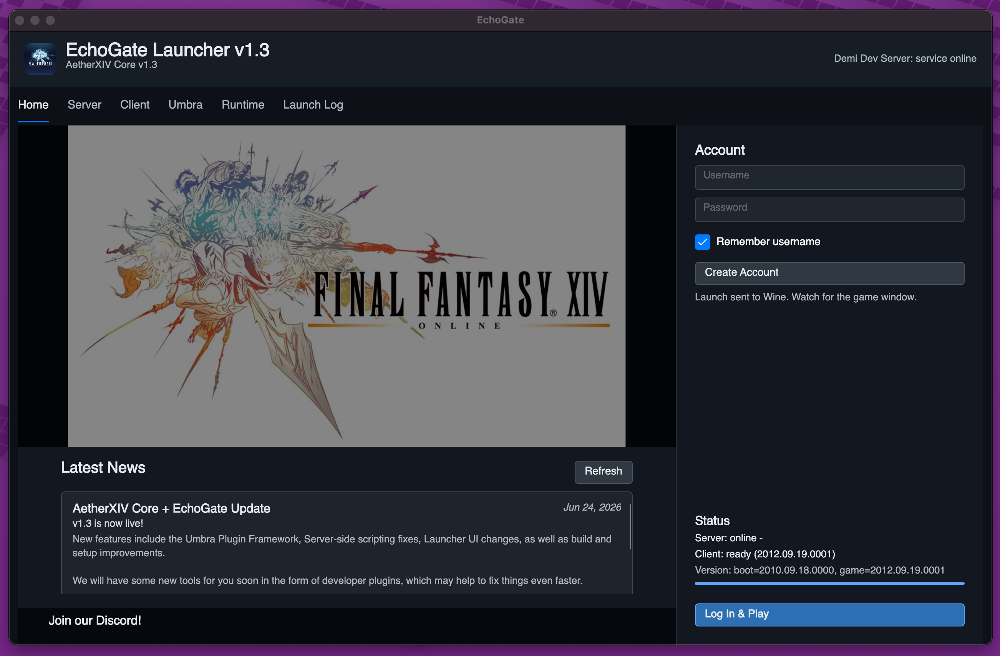
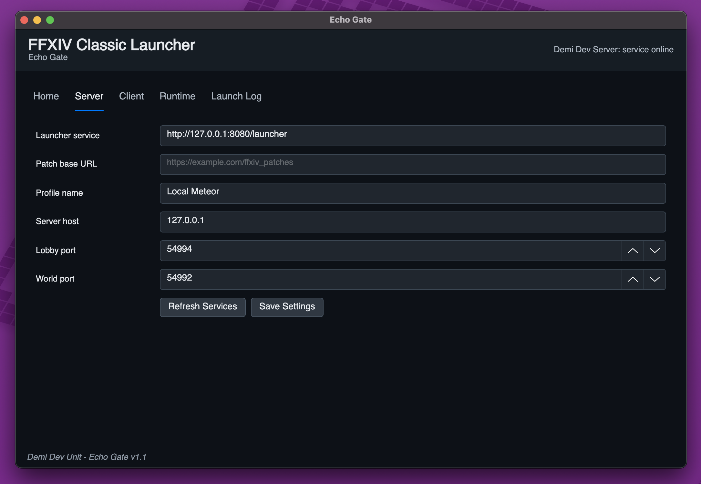
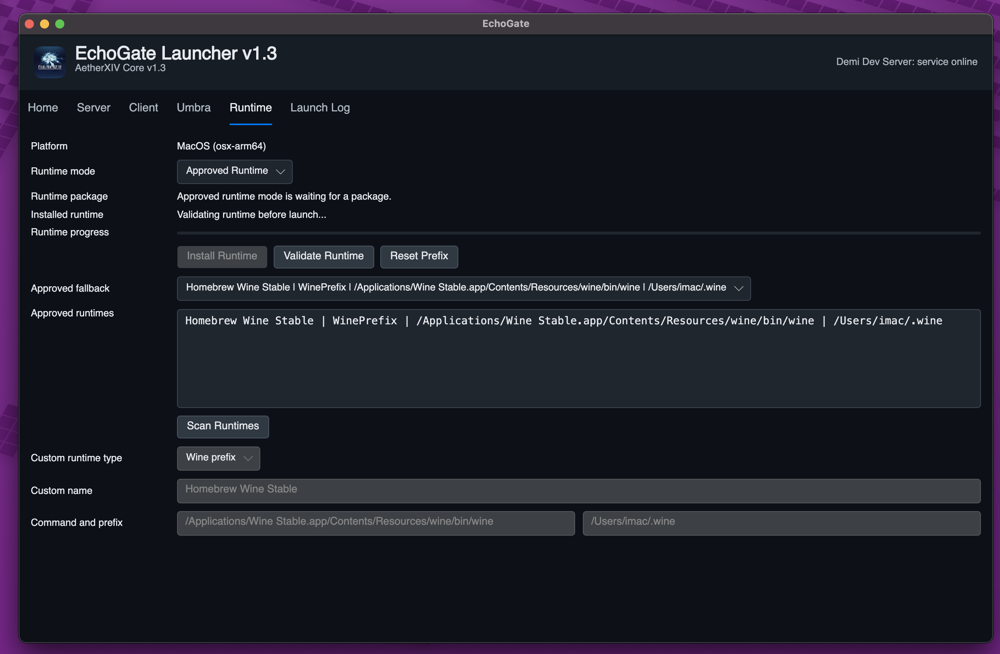

# Echo Gate Features

Echo Gate is the cross-platform launcher for MeteorXIV Core. It is designed to keep the player-facing setup in one app while still letting self-hosters point at their own local or remote server.



## Home And Accounts

- Shows launcher service status and news from the configured server.
- Creates accounts through the launcher service.
- Logs in through the launcher service and receives a session id.
- Enables `Log In & Play` once the server, account session, client version, and runtime are ready.
- Remembers the username when selected.

News posts are served from the `launcher_news` database table through `/launcher/news`. See the [Launcher News Guide](guides/LAUNCHER_NEWS.md) for backend examples.

## Server Profile



- Stores the launcher service URL.
- Stores the patch base URL when a self-hosted patch manifest is available.
- Stores a profile name, server host, lobby port, and world port.
- Defaults to a local server profile at `127.0.0.1`.
- Refreshes service metadata without requiring users to edit INI files by hand.

## Client And Patch Handling

- Validates a local FFXIV 1.23b client folder.
- Checks `boot.ver` and `game.ver`.
- Validates user-provided patch files by path, size, and checksum metadata.
- Applies patch payloads into the selected local client folder.
- Prepares local server runtime data such as `Data/staticactors.bin`.
- Searches expected 1.x client script locations and saved Echo Gate client paths before asking for manual input.

Client installers, client files, patch files, and patch torrents are intentionally not bundled with this repository.

## Runtime Handling



- Uses an approved-runtime flow on macOS and Linux.
- Supports approved runtime catalog installs when hosted runtime archives are available.
- Supports approved detected Wine Stable paths, with custom runtime entries available only when the user chooses the advanced custom path.
- Validates the selected runtime before launch.
- Can reset the managed prefix.
- Uses safer Linux defaults for the legacy DirectX 9 client path.

## Launching

- Writes a legacy-compatible `Servers.xml` under Echo Gate app data.
- Generates the 1.23b launch argument expected by the client.
- Starts `ffxivgame.exe` through the selected runtime on macOS/Linux.
- Launches the Windows client directly on Windows builds.
- Applies the verified 1.23b lobby host and CPU-thread patches before resuming the client.
- Records helper logs, runtime validation logs, and launch logs under Echo Gate app data.

## Diagnostics

Use the log collector when a launch crashes or silently exits:

```sh
./tools/collect-echo-gate-logs.sh --files 10 --lines 160
```

The most useful logs are usually the newest `launch-*.log`, `launch-*.helper.log`, and `runtime-validate-*.log` files.
