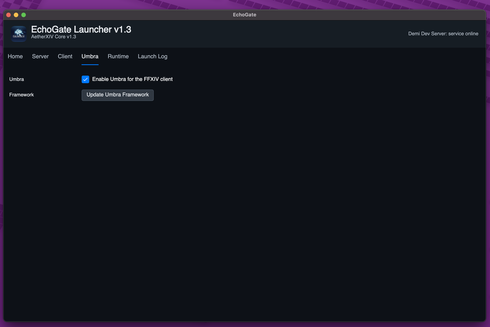

# Umbra Framework Development Notes

Umbra is the AetherXIV client plugin framework for EchoGate-launched FFXIV 1.x clients.
This document records the current implementation boundary so development stays
evidence-led.

## Current Mechanics

- EchoGate resolves Umbra settings during launch and passes them to the x86
  client helper.
- The x86 helper starts `ffxivgame.exe` suspended, applies the existing launch
  patches, and injects `Aether.Umbra.Bootstrap.x86.dll` with `LoadLibraryW`.
- The bootstrap DLL reads `METEOR_UMBRA_*` environment values inherited by the
  game process, writes the Umbra log, resolves `hostfxr.dll`, and calls the
  managed Umbra entrypoint inside the game process.
- The managed framework reads the same runtime settings, scans the plugin
  directory for `umbra-plugin.json` or `plugin.json`, validates manifests, and
  records discovered plugins.
- The managed framework fetches supported and custom repository JSON catalogs,
  caches last-successful repository responses, parses Umbra and common
  Dalamud-style store fields, and separates Installed, Supported, Available,
  and Updates state.
- Plugin downloads are verified by size and SHA256 before extraction. Archive
  paths that are absolute or contain `..` are rejected. Installed plugins are
  written with a validated `umbra-plugin.json`, but third-party assemblies are
  not executed in this stage.
- The native bootstrap hooks the Direct3D 9 path, initializes the current ImGui
  shell after a valid device is observed, and renders the initial Umbra controls
  and bottom-right toast panels during live client testing.

This proves the launcher-to-helper-to-game-to-bootstrap-to-framework path and the
first in-game rendering shell without claiming that third-party plugin execution
is enabled yet.

## Catalog Model

Umbra uses separate catalogs for separate trust boundaries.

Framework catalog:

- Endpoint: `/launcher/umbra/framework-catalog?platform=win-x86`
- Backing table: `launcher_umbra_framework_artifacts`
- Purpose: tells EchoGate which Umbra framework bundle can be installed.
- Payload includes archive URL, archive size, SHA256, bootstrap DLL path,
  managed framework path, supported game hashes, active/default flags, and sort
  order.

Plugin catalog:

- Supported repository URLs come from active supported rows in
  `launcher_umbra_plugin_repositories`.
- `launcher_umbra_plugin_releases` remains available as an optional future cache,
  but it is not the source of truth for the in-game installer.
- If no supported repository rows exist, `plugin_catalog_urls` is empty and the
  Supported tab has no entries.
- Custom repository URLs are user-provided HTTPS URLs, with localhost HTTP
  allowed for development.
- Endpoint: `/launcher/umbra/plugin-blocklist`
- Backing table: `launcher_umbra_plugin_blocks`
- Purpose: disables known-broken plugin ids/versions before plugin execution is
  ever enabled.

The launcher service config exposes:

- `client_plugin_framework_catalog_url`
- `plugin_catalog_urls`
- `plugin_blocklist_url`

Framework bundles and plugin archives should never be trusted by URL alone.
Every downloadable artifact must be checked against the size and SHA256 recorded
in the catalog before installation.

## Plugin Manifest Convention

Umbra scans:

- `<plugin directory>/umbra-plugin.json`
- `<plugin directory>/plugin.json`
- `<plugin directory>/<plugin folder>/umbra-plugin.json`
- `<plugin directory>/<plugin folder>/plugin.json`

Required manifest fields:

- `id`
- `name`
- `version`
- `api_version`
- `entry`
- `minimum_framework_version`
- `enabled`

`entry` must be a relative assembly path and may not contain `..` path segments.

## Evidence-Gated Work

The next mechanics need client/runtime evidence before implementation:

- Stabilized Direct3D 9 reset/lost-device handling for the 1.23b client under
  Wine and native Windows.
- A polished ImGui theme, persistent window positioning, and input capture rules
  for an overlay that will not break existing client controls.
- Crash containment strategy for plugin load, update, draw, and disposal failures.

Until those are known, Umbra should stay in catalog, installer, manifest, and
safe in-game shell mode rather than pretending to run plugins.
