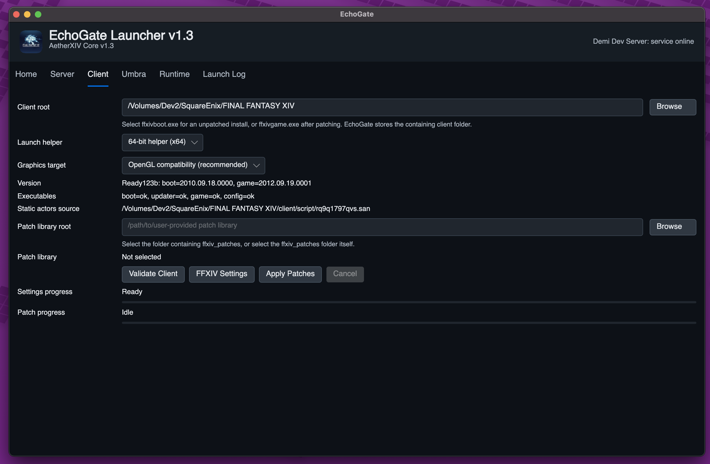

# Windows ARM/x86 Setup

Windows can run the legacy client directly. Windows ARM64 can build Echo Gate, but x86 client emulation still needs validation. The easiest Windows x86 path is to use the GitHub Release packages, then let the PowerShell helpers set up the database, runtime data, smoke checks, and local services.

Windows helper scripts live in:

```text
tools/windows/
```

Run the commands below from PowerShell in either a full source checkout or the extracted `AetherXIV-Server-Core` release package. New users should start with `tools/windows/setup.ps1`; older script names are kept as compatibility wrappers.

## Quick Path For Windows x86

Use this path if you just want to run a local playtest server and launcher. The Windows package is a normal `.zip`; use the `.tar.gz` only if you specifically want it.

1. Download the GitHub Release assets:

```text
AetherXIV-Server-Core-v1.3.zip
EchoGate-win-x86-v1.3.zip
```

2. Extract `AetherXIV-Server-Core-v1.3.zip` somewhere writable, such as:

```text
C:\AetherXIV\server-core
```

3. Open PowerShell in that folder.

```powershell
cd C:\AetherXIV\server-core
Set-ExecutionPolicy -Scope Process Bypass
```

4. Run Windows setup.

```powershell
.\tools\windows\setup.ps1 -InstallMissing -ClientDir "C:\Path\To\FINAL FANTASY XIV"
```

`-InstallMissing` asks Windows for administrator permission when needed. The setup script installs/verifies prerequisites, prepares the database, prepares local client-derived runtime data, runs smoke checks, and writes an environment report to Echo Gate app data. It does not move or copy your client install folder.

Setup transcripts are saved automatically under `tools\windows\logs\windows-setup-*.log`. The final machine/setup report is written to `%APPDATA%\Demi Dev Unit\Echo Gate\setup-state.json`.

If you only want to inspect the machine without installing anything:

```powershell
.\tools\windows\doctor.ps1 -ClientDir "C:\Path\To\FINAL FANTASY XIV"
```

The setup uses one canonical entrypoint, `tools\windows\setup.ps1`. Internally it uses `winget` where it is reliable, installs Echo Gate's managed PHP from the official Windows PHP build when PHP is missing, verifies the PHP zip checksum, repairs the Microsoft Visual C++ x64 runtime from Microsoft's official redistributable when it is too old for PHP, refreshes `PATH` for the current PowerShell process, and enables PHP `mysqli` automatically. Source builds also fall back to a managed `nuget.exe` under Echo Gate app data when NuGet is not available on `PATH`.

The default local database settings are:

```text
database: ffxiv_server
username: aetherxiv
password: aether_dev
hosts: localhost, 127.0.0.1
```

The setup script asks for your MariaDB admin password so it can create the database, import `Data/sql/*.sql`, grant the local app user access, prepare runtime data, and run a smoke check. There is no AetherXIV default for the MariaDB admin password; it belongs to your local MariaDB install. Try a blank password only if the MariaDB installer never asked you to set one. If that is wrong, setup lets you retry the admin username and password without restarting.

5. Start the local hosting stack.

```powershell
.\tools\windows\run-local-stack.ps1
```

This opens one PowerShell window for each service. The launcher web service starts by default because it is required for local hosting. It is checked by port, then Lobby, Map, and World each write a readiness signal after their own startup path finishes. The stack waits for that signal before starting the next server and updates the launcher status row to `online` after all game services are ready.

If a slower machine needs more time, pass a larger timeout:

```powershell
.\tools\windows\run-local-stack.ps1 -StartupTimeoutSeconds 90
```

If an expert is using an external launcher web service and only wants game services:

```powershell
.\tools\windows\run-local-stack.ps1 -SkipWeb
```

Service ports:

```text
launcher HTTP: 8080
lobby server: 54994
map server: 1989
world server: 54992
```

6. Extract `EchoGate-win-x86-v1.3.zip`, then run:

```text
publish\EchoGate.App.exe
```

Configure Echo Gate:

- Server tab: `http://127.0.0.1:8080/launcher`
- Client tab: select your local FFXIV 1.23b client folder.
- Runtime tab: no Wine is needed on Windows.
- Home tab: create an account, log in, and launch.




If you are testing Umbra on Windows, enable it from the Umbra tab before launching.


Expected setup result:

- PHP, PHP `mysqli`, MariaDB/MySQL client, and server executables are found.
- `.NET Framework 4.7.2` or newer is available.
- The `aetherxiv` app user can connect to `ffxiv_server`.
- Lobby, World, and Map smoke checks complete.

## Release Package Notes

The server core release package includes:

- Built Lobby, Map, and World server outputs.
- SQL seed/import files in `Data/sql/`.
- PHP launcher services in `Data/www/`.
- Runtime configs and scripts in `Data/`.
- Windows setup helpers in `tools/windows/`.

The release packages do not include:

- FFXIV client installers.
- FFXIV client files.
- Patch payloads.
- Patch torrents or metainfo files.
- Wine runtimes.
- `Data/staticactors.bin`.

`staticactors.bin` is client-derived and must be prepared locally from your own FFXIV 1.x client folder.

## Source Build Path

Use this path if you are building from a full source checkout.

Install:

- MariaDB
- PHP
- Visual Studio or MSBuild
- .NET Framework 4.7.2 Developer Pack
- NuGet
- .NET 10 SDK

From the repository root:

```powershell
Set-ExecutionPolicy -Scope Process Bypass
.\tools\windows\setup.ps1 -Mode Build -Runtime win-x86 -InstallMissing -ClientDir "C:\Path\To\FINAL FANTASY XIV"
```

The setup script:

- Creates/imports the local MariaDB database.
- Creates/updates the `aetherxiv` database user.
- Restores and builds the legacy server solution.
- Prepares `staticactors.bin` from your local client.
- Copies config/scripts/runtime data beside server executables.
- Publishes Echo Gate for `win-x86`.

Useful bootstrap switches:

```powershell
.\tools\windows\setup.ps1 -Mode Build -Runtime win-x86 -InstallMissing
.\tools\windows\setup.ps1 -Mode Build -Runtime win-x86 -SkipDatabase
.\tools\windows\setup.ps1 -Mode Build -Runtime win-x86 -SkipBuild
.\tools\windows\setup.ps1 -Mode Build -Runtime win-x86 -SkipLauncher
```

## Individual Windows Helpers

Check release/runtime prerequisites:

```powershell
.\tools\windows\install-prereqs.ps1 -Mode Run
```

Install missing release/runtime prerequisites:

```powershell
.\tools\windows\install-prereqs.ps1 -Mode Run -Install
```

Check or install source-build prerequisites:

```powershell
.\tools\windows\install-prereqs.ps1 -Mode Build
.\tools\windows\install-prereqs.ps1 -Mode Build -Install
```

Refresh Echo Gate managed tools, such as managed PHP and managed NuGet, from their official sources:

```powershell
.\tools\windows\install-prereqs.ps1 -Mode Build -Install -RefreshManagedTools
```

One-command release setup:

```powershell
.\tools\windows\setup.ps1 -InstallMissing -ClientDir "C:\Path\To\FINAL FANTASY XIV"
```

Write a setup report without changing anything:

```powershell
.\tools\windows\doctor.ps1 -ClientDir "C:\Path\To\FINAL FANTASY XIV"
```

Setup logs and reports:

```text
tools\windows\logs\windows-setup-*.log
tools\windows\logs\install-prereqs-*.log
tools\windows\logs\build-legacy-*.log
%APPDATA%\Demi Dev Unit\Echo Gate\setup-state.json
```

Database only:

```powershell
.\tools\windows\setup-local-db.ps1
```

Drop and recreate the database before importing:

```powershell
.\tools\windows\setup-local-db.ps1 -Drop
```

Build legacy servers from source:

```powershell
.\tools\windows\build-legacy.ps1
```

Build Echo Gate for Windows x86:

```powershell
.\tools\windows\build-echo-gate.ps1 -Runtime win-x86
```

Supported Echo Gate Windows publish targets:

```text
win-x86
win-x64
win-arm64
```

Copy configs, scripts, and `staticactors.bin`:

```powershell
.\tools\windows\copy-runtime-data.ps1 -ClientDir "C:\Path\To\FINAL FANTASY XIV"
```

Start the local stack:

```powershell
.\tools\windows\run-local-stack.ps1
```

The local stack starts the launcher web service by default. If you need to debug a single service, you can still start services one at a
time. For the full stack, prefer `run-local-stack.ps1` because it waits for the
managed server readiness signals in order:

```powershell
.\tools\windows\run-web.ps1
.\tools\windows\run-lobby.ps1
.\tools\windows\run-map.ps1
.\tools\windows\run-world.ps1
```

## Manual Build Commands

If you prefer to build manually:

```bat
nuget restore AetherXIV.Core.sln
msbuild AetherXIV.Core.sln /p:Configuration=Release
```

After a manual build, still run:

```powershell
.\tools\windows\copy-runtime-data.ps1 -ClientDir "C:\Path\To\FINAL FANTASY XIV"
```

The Map Server needs these files beside its executable:

```text
map_config.ini
scripts\
staticactors.bin
```

Lobby and World need their config files beside their executables:

```text
lobby_config.ini
world_config.ini
```

## Troubleshooting

If PowerShell blocks a script, run:

```powershell
Set-ExecutionPolicy -Scope Process Bypass
```

If `php.exe` is missing, rerun setup with `-InstallMissing`. Echo Gate installs a managed PHP runtime under app data. Experts can still set `PHP_BIN` to the full `php.exe` path.

If `php mysqli` is missing, rerun:

```powershell
.\tools\windows\setup.ps1 -InstallMissing -ClientDir "C:\Path\To\FINAL FANTASY XIV"
```

The setup script reports whether PHP was found, whether `php.ini` exists, whether `extension_dir` exists, whether `php_mysqli.dll` exists, whether `extension=mysqli` is enabled, and whether `php -m` actually lists `mysqli`. If repair is needed, it creates or updates `php.ini`, sets `extension_dir` to the detected PHP `ext` folder, and enables `extension=mysqli`. If PHP still reports a loader error, setup prints the loader output. A message like `VCRUNTIME140.dll ... is not compatible with this PHP build` means the Microsoft Visual C++ x64 runtime is too old; rerun setup with `-InstallMissing` and let it install or repair the official Microsoft redistributable.

If NuGet is missing during a source build, rerun:

```powershell
.\tools\windows\install-prereqs.ps1 -Mode Build -Install
```

`build-legacy.ps1` also installs a managed `nuget.exe` automatically if NuGet is still not found.

If `winget` says `No newer package versions are available` while installing MariaDB/MySQL, it usually means the package is already installed. Open a new PowerShell window and rerun the prerequisite check.

If MariaDB/MySQL is still not detected, run the detector:

```powershell
.\tools\windows\diagnose-mariadb.ps1
```

If the detector prints a MariaDB client path, test the admin login manually:

```powershell
& "C:\Program Files\MariaDB 11.x\bin\mariadb.exe" -h localhost -P 3306 -u root -p
```

Then force setup to use that client in the current PowerShell window:

```powershell
$env:MYSQL_BIN = "C:\Program Files\MariaDB 11.x\bin\mariadb.exe"
.\tools\windows\setup.ps1 -InstallMissing
```

If the database setup cannot connect, confirm MariaDB is running and rerun:

```powershell
.\tools\windows\setup-local-db.ps1 -AdminUser root
```

If the root/admin password is wrong, the script will offer another admin username and password prompt. For a fresh local MariaDB install that never asked for a password, try submitting a blank password first. If blank fails too, MariaDB likely has a password from a previous data directory or a silent installer setting. Reinstall or reset MariaDB with a known local root password, then rerun setup with:

```powershell
.\tools\windows\setup-local-db.ps1 -AdminUser root
```

If the Map Server smoke check fails because `staticactors.bin` is missing, rerun:

```powershell
.\tools\windows\copy-runtime-data.ps1 -ClientDir "C:\Path\To\FINAL FANTASY XIV"
```

If the launcher cannot reach the server, confirm these are running:

```text
http://127.0.0.1:8080/launcher
Lobby Server
Map Server
World Server
```

## Windows ARM64 Note

Echo Gate has a `win-arm64` publish target. The legacy client is still a 32-bit Windows program, so real client launch behavior on Windows ARM64 needs validation.
